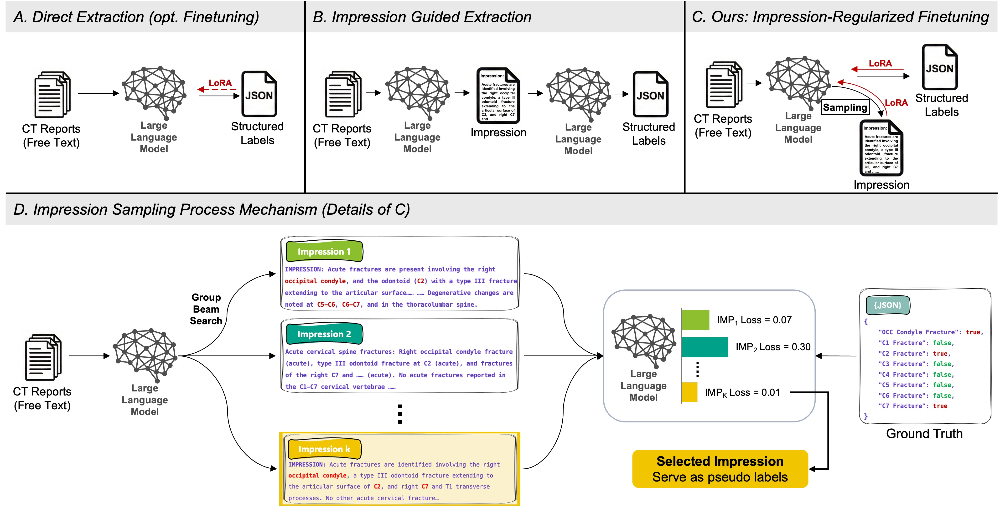

# Cervical spine fracture LLM study

Code and aggregate data for *Impression-Regularized Finetuning Enables Small Language Models to Extract Cervical Spine Fractures from Radiology Reports*.

The models extract eight binary acute fracture labels (occipital condyle and C1–C7) from cervical spine CT reports. Impression-regularized LoRA samples short, fracture-focused impressions, selects one by how well it supports the reference JSON labels, and uses it as lower-weight supervision alongside the JSON task. Inference produces JSON labels in a single pass from the report.



## Input format

Use one CSV row per report and a unique, nonempty `Linking_ID` in every file. The complete [synthetic cohort](examples/synthetic_cohort.csv) shows the training format; no private reports are included.

| Stage | Required CSV columns |
| --- | --- |
| Impression selection and training | `Linking_ID`, `Report_Text`, `Output_report` |
| Selected impressions for impression-regularized training | `Linking_ID`, `Impression_Response` |
| Inference | `Linking_ID`, `Report_Text` |
| Evaluation ground truth and predictions | `Linking_ID` and the eight fracture label columns |

`Output_report` is a CSV-quoted JSON object with Boolean values for `Occ_Condyle_Fracture` and `C1_Fracture` through `C7_Fracture`. Ground-truth label columns use `0` or `1`. Include `Fracture_Case` when sampling a published subset size from a larger cohort. See also the [synthetic selected impressions](examples/synthetic_beam_samples.csv) and [synthetic predictions](examples/synthetic_predictions.csv).

## Run the model pipeline

Run these commands from the repository root with Python 3.11, CUDA-enabled PyTorch, and access to the chosen model weights. `gemma-3-4b-it` is an example model key; other keys are in [model_constants.py](finetuning/model_constants.py).

1. Install the model dependencies:

   ```bash
   python -m pip install -r requirements.txt
   ```

2. Sample impressions and select one per training report:

   ```bash
   python -m finetuning.llm_beam_sampling --model_id gemma-3-4b-it --train-csv examples/synthetic_cohort.csv --output outputs/selected_impressions.csv
   ```

3. Train impression-regularized LoRA using that selection:

   ```bash
   python -m finetuning.llm_ft_sampling_based_mixed_scaling --model_id gemma-3-4b-it --train-csv examples/synthetic_cohort.csv --beam-samples-csv outputs/selected_impressions.csv
   ```

   For the standard JSON-only LoRA baseline, run `python -m finetuning.llm_plain_lora_dataset_scaling --model_id gemma-3-4b-it --train-csv examples/synthetic_cohort.csv` instead. Training defaults to seed 42; `--seed N` changes it.

4. Run inference with the checkpoint printed by training:

   ```bash
   python infer.py --input examples/synthetic_cohort.csv --model gemma-3-4b-it --adapter CHECKPOINT_DIR --output outputs/predictions.csv
   ```

   Replace `CHECKPOINT_DIR` with the saved checkpoint path. Omit `--adapter CHECKPOINT_DIR` to run the base model.

5. Evaluate predictions against a CSV with the same report IDs and eight ground-truth labels:

   ```bash
   python evaluate.py --ground-truth examples/synthetic_cohort.csv --predictions outputs/predictions.csv --output outputs/evaluation.csv
   ```

The synthetic files demonstrate the format, not a study evaluation. Use separate training and held-out CSVs for a real run. Outputs are written under `outputs/`, which is ignored by Git; choose a new output path when rerunning inference or impression selection. `--sft-config path.json` overrides other SFT settings, and `--eval-csv path.csv` enables evaluation after training.

## Reproduce tables and figures

`reproducibility/` contains the released non-identifying derived data and scripts needed to regenerate the reported tables and figures. In a separate environment, run:

```bash
python -m pip install -r reproducibility/requirements.txt
python reproducibility/reproduce_all.py
```

## Data availability

The dataset consists of cervical spine CT radiology reports and vertebral-level fracture labels from St. Michael’s Hospital, Unity Health Toronto. Because the reports contain free-text clinical information that may remain potentially re-identifiable, the dataset cannot be deposited in a public repository under institutional privacy and research ethics requirements. Data-access requests may be submitted to Errol Colak, MD ([errol.colak@unityhealth.to](mailto:errol.colak@unityhealth.to)). Requests will be reviewed in accordance with applicable institutional privacy, research ethics, and data-governance requirements and may require research ethics approval and a data-use agreement. The dataset will be retained on secure, access-controlled St. Michael’s Hospital institutional storage. Aggregate data underlying the figures and tables, together with code supporting the reported analyses are available at [reproducibility materials](reproducibility/).

## Citation

If you use this repository, please cite the accompanying paper:

```bibtex
@unpublished{hu_impression_regularized_cspine,
  author = {Hu, Zixuan and Lin, Hui Ming and Chen, Yingming Amy and Lozano, Christopher S. and Patel, Markand and Emami, Ali and Sejdi{\'c}, Ervin and Colak, Errol},
  title = {Impression-Regularized Finetuning Enables Small Language Models to Extract Cervical Spine Fractures from Radiology Reports},
  note = {Publication details pending}
}
```
